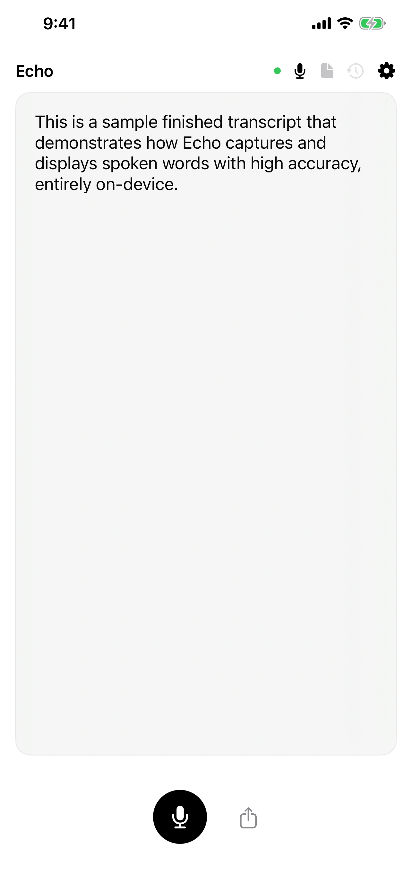
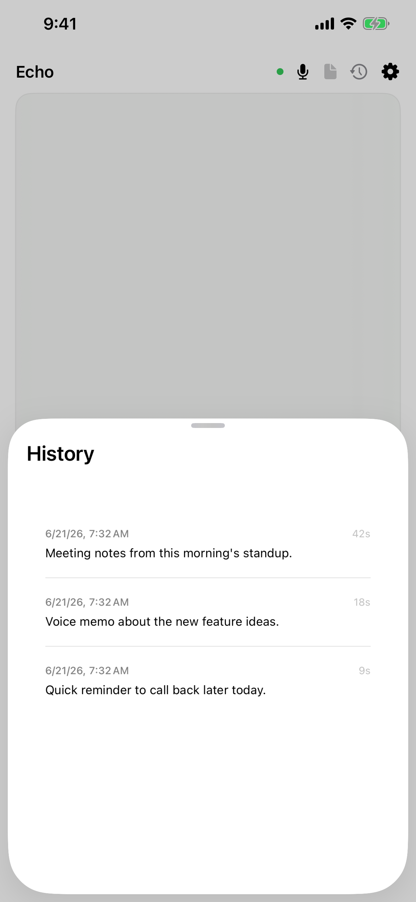
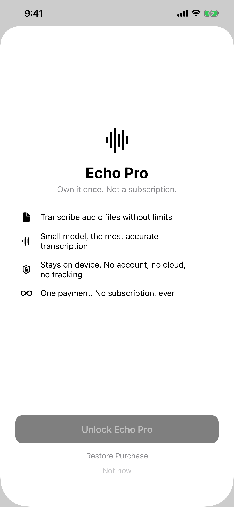
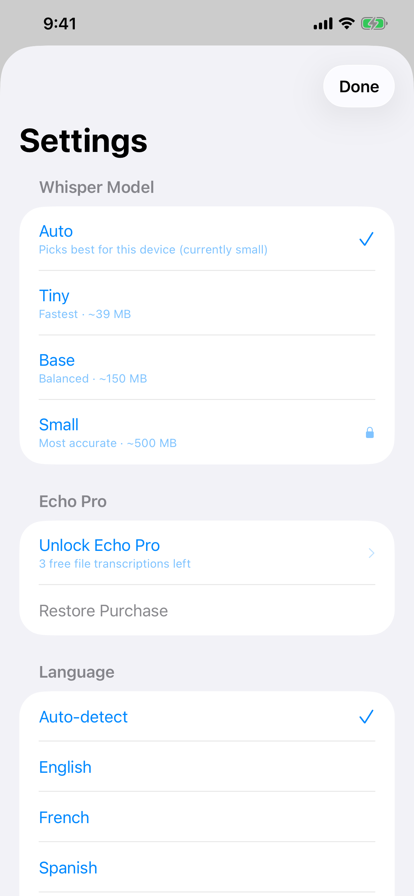
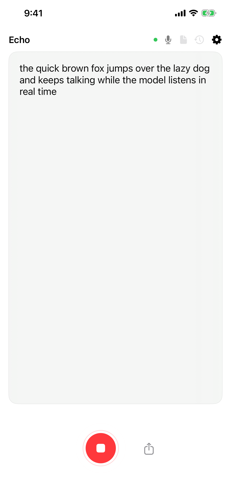

# Echo

   [](https://github.com/nulljosh/echo)

Native on-device speech transcription using [WhisperKit](https://github.com/argmaxinc/WhisperKit). Runs entirely locally — no cloud, no API keys, no data leaves the device.

<p align="center">
  
  
  
  
  
</p>

## Features

- Live microphone recording with real-time transcription and waveform
- File transcription — drag/drop on macOS, browse on iOS
- 12 languages — auto-detect or force specific
- Auto model selection based on device RAM
- Persistent history (max 50 entries)
- Export / share / copy to clipboard
- Retry on model load failure
- Cmd+R shortcut (macOS)
- Light/dark mode
- iOS + macOS SwiftUI

## Architecture


`AVAudioEngine` captures mic at native sample rate, resampled to 16kHz mono Float32. Waveform driven by RMS per buffer. Batches transcribe every 2 seconds via `WhisperKit` CoreML inference. File mode uses `AVAudioFile` for duration. History (max 50) persists to `Documents/echo-history.json`.

## Build

```bash
xcodegen generate
open echo.xcodeproj
```

Select `Echo-iOS` or `Echo-macOS`. First launch downloads the Whisper model (~39MB tiny, ~150MB base, ~500MB small). Auto mode picks the right size for your device.

## Roadmap

XCTest suite, snapshot tests, Apple Shortcut integration.

- [ ] Fix macOS NavigationSplitView background seam — sidebar vibrancy material renders a visibly different shade than the detail pane despite both using `Color(.windowBackgroundColor)`. Needs a real styling pass (e.g. `.navigationSplitViewStyle` override or custom sidebar background), not a one-line value fix.
- [ ] Mac TestFlight: `fastlane mac_beta` lane added 2026-06-21. Fixed missing `CFBundlePackageType` in `Sources/macOS/Info.plist` (confirmed `APPL` in the built archive), but `pilot` upload still fails with the same "Invalid Bundle OS Type code" error from `altool` — points to the export/.pkg step, not the source Info.plist. Needs further debugging before this can ship to TestFlight.

## License

MIT 2026, Joshua Trommel
