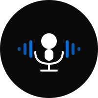
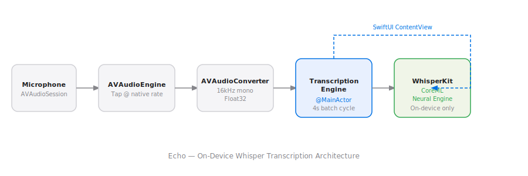

# Echo

  

Native on-device speech transcription using [WhisperKit](https://github.com/argmaxinc/WhisperKit). Runs entirely locally — no cloud, no API keys, no internet required after model download.

## Features

- Real-time transcription via Whisper AI (CoreML + Neural Engine)
- Model selection: tiny / base / small
- Transcription history with timestamps and duration
- Copy to clipboard
- iOS + macOS native SwiftUI

## Architecture



AVAudioEngine captures microphone input, converts to 16kHz mono Float32, and batches audio every 4 seconds to WhisperKit for local inference.

## Build

```bash
xcodegen generate
open echo.xcodeproj
```

Select `Echo-iOS` or `Echo-macOS` target and run.

## License

MIT 2026, Joshua Trommel
